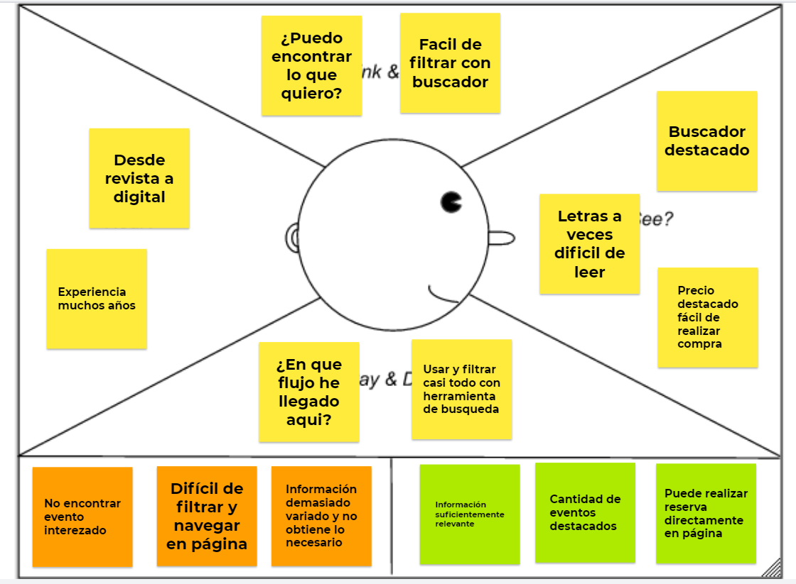
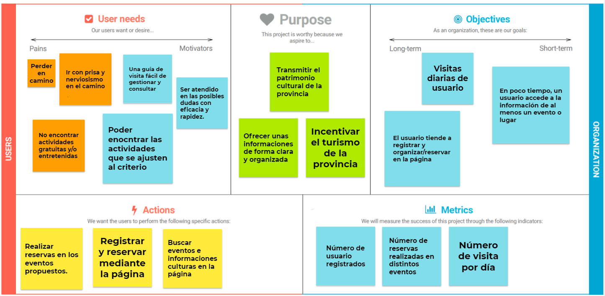
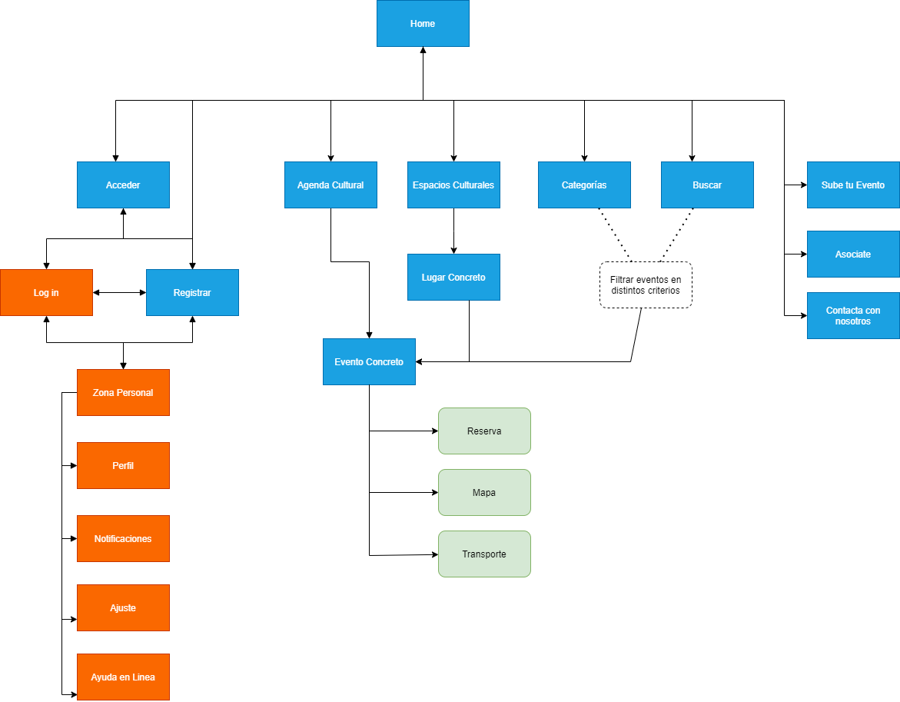
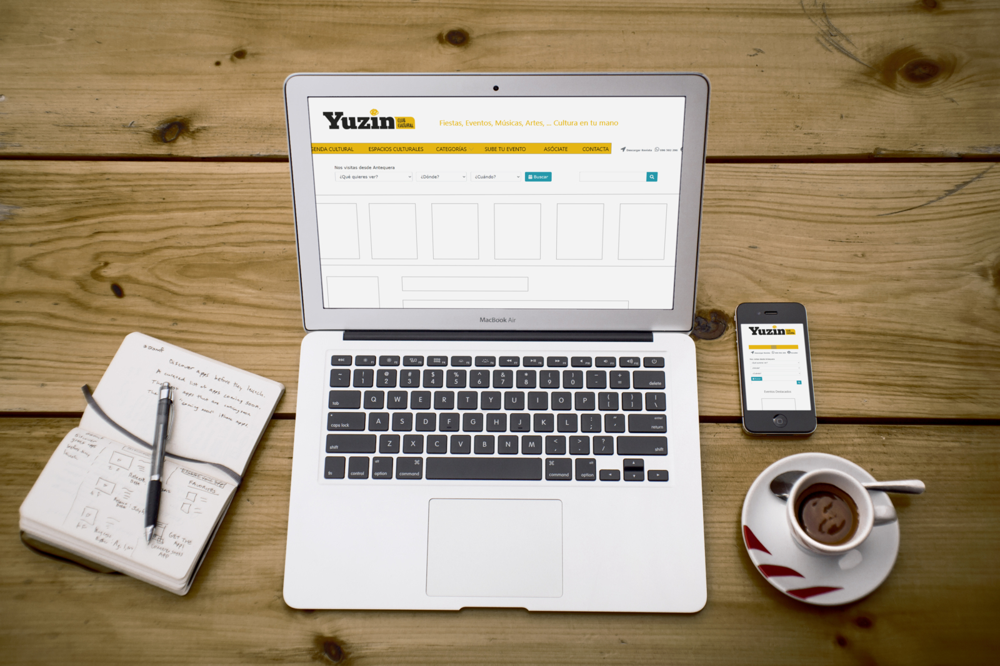
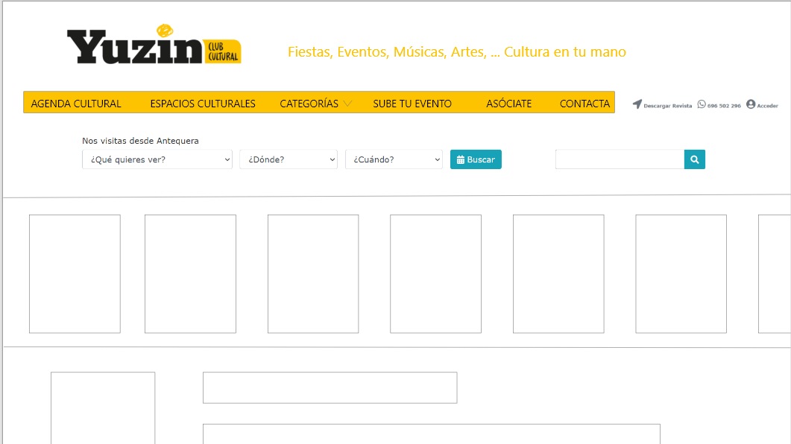
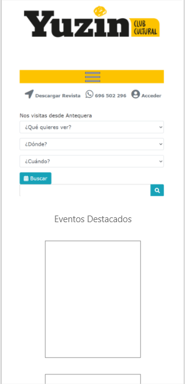

Autor:

Wu, Weibin

Github: https://github.com/Wei-bin-Wu/DIU_Final

# DIU_Final
> Trabajo final de asignatura DIU

## Parte 1: MI EXPERIENCIA UX
> Esta parte comentaré sobre algunas aportaciones que se ha tenido en actividades de clases de teoría y el proyecto de práctica.
### 1.1 Ejercicios y actividades de clase
En clase de teoría hemos tenido como actividades casi cada semana un seminario y un ejercicio a realizar en clase, por otra parte, también hemos tenido unos cuantos ejercicios para entrega. Como comentario general para el culso, lo veo bastante bien esta técnica ya que además de aprender la teoría, también hemos tenido posibilidad de aplicarla ya que no ha sido posible aplicar todos en la práctica.

Como actividades entegable hemos tenido los siguientes:

* Etnografía: esta actividad nos enseñó cómo analizar una situación real de interacción de persona con máquina, con ello aprendemos los factores que se debe tener encuenta (en relación con el tema, no solo la máquina como funciona, sino muchos más factores, entorno, persona, cultura, percepción, etc...) y la importancia del factor humano, ya que es en fin quienes más debe satisfacer y quienes más sufre por un mal diseño.

* Usabilidad: esta actividad estudiamos usabilidad comparando distintas páginas webs de distintos universidades. Con ello aprendemos algunas pautas de estudio, se debe ver desde distintas perspectivas (Heurística, test rendimiento, accesibilidad, y otros más técnicas que no hemos ralizado en esta entrega pero sí en temario como entrevista, heat map, etc...), estudiando estos para conseguir que la página sea efectivo, eficiente y obteniendo un resultado satifactorio para usuario,

* Accesibilidad: esta actividad es transladado de práctica a ser como entrega. Apredemos en usar distintas herramientas existentes para estudiar y los elementos necesario y preferibles tener para accesibilidad, también, algunas estándares existentes para evaluar a estos. 

Como seminario en clase, hemos realizado muchos y distintas actividades en cada semana de clase para aprender uso de algunas técnicas que se enuncia en el temario, por ejemplo Moodboard, Malla receptora, Mapa de empatía, etc..., que posteriormente muchas de ellas lo hemos aplicado en la práctica para aprender todos más integrado en mismo proyecto.

### 1.2 Parte práctica
Para parte de práctica, hemos hecho cosas parecido a los seminarios hecho en clase de teoría, pero en este caso, mucho más completo y asociado, ya que hemos tenido que realizar todos los pasos sobre un mismo proyecto, en ellos, aprendemos donde alojar cada parte, cada técnica, y como relacionar el resultado obtenido en cada uno para concluir como un estudio y rediseño más o menos decentes.

Por ejemplo, primero realizamos análisis a páginas con objetivos parecidos usando técnicas como: Análisis Competencia, User Journey Map y Usability review, usando resutados formulamos Malla receptora y ScopeCanvas para ver los puntos importantes e objetivos que se debe conseguir.Posteriormente se intenta visualizar distintos funciones y roles que vamos a tener y el flujo de uso de nuestra aplicación, obteniendo así un sitmap y los task matrix y task flow. Mediante ello, se realiza un Moodboard como inspilación y un estudio de patrones de diseño para obtener un Mockup. Finalmente se evalua todo el proyecto usando distintas técnicas de evaluación como A/B testing, UXCaseStudy,... para averiguar finalmente si es un proyecto válido, rediseñable o desechable.

### 1.3 Otras aportaciones
Para comentar sobre aportaciones en otras asignaturas, este año he tenido asigneturas como Desarrollo de Software(DS), Sistema Informático Basado en Web(SIBW), Desarrollo de Sistema Distribuido(DSD) y Sistema Gráfico(SG), en los que todos ellos han tenido que diseñar cosas relacionado con el interfaz para usuario, por ejemplo DS y SIBW han tenido que diseñar flujos e interfaz en aplicación tanto en móvil (en Flutter) y como en web, y para ellos he considerado últil los distintos patrones de diseño aprendido y técnica de evaluaciones en esta asignatura, también en DSD y SG han tenido que diseñar una interfaz simple. Luego se observa la importancia tanto de uso como de posterior continuo estudio sobre el interfaz ya que es el primer toma de contacto y posterior continuo experiencia de usuario a la aplicación, y teniendo en cuenta muchos factores se va cambiando a lo largo del tiempo, se necesitaría un continuo renovación del interfaz.

## Parte 2: Caso de estudio. Web YUZIN

> Como no tenemos un guión predefinido para este trabajo y los pasos que nos hemos apredido y más conocido son las dada en práctica, decido usarme sino totalmente mismo, pues algo parecido a algunos de los pasos dados en la práctica, para no desviarme del contexto.

### Competitive Analysis

> Para analizar algunas características y comparar con otras páginas de igual objetivo, utilizo esta técnica.

Página a analizar:

* [**Yuzin**](https://yuzin.com/) : Página de divulgación de eventos culturales para Granada y Sevilla, ha sido hace muchos años una revista, y actualmente se adaptó a tecnología contemporanea. 

* [**Málaga de cultura**](https://malagadecultura.com/) : Igualmente, página que tiene objetivo difundir eventos y culturas de Málaga.

* [**Teleagenda**](https://teleagenda.cordoba.es/) : Con el mísmo objetivo para provincia Córdoba, esta página es creada por ayuntamiento, es decir, es institucional.

Cracterísticas comparado:

| PLATAFORMAS             | Yuzin | Málaga de cultura | Teleagenda |
|:-----------------------:|:----------:|:-----------:|:-------:|
| Idiomas Disponibles     | 1         | 1  | 1  |
| Web                     | SI         | SI | SI |
| IOS                     | NO         | NO | NO |
| Android                 | NO         | NO | NO |
| Personalización         | SI         | NO | NO |
| Reserva  | SI         | NO | NO |
| Redes Sociales Oficiales | SI         | SI | SI |
| Facil navegar con menú | MEDIO         | FACIL | FACIL |
| Opciones de menú | 5         | 10 | 9 |
| Menú secundario | NO         | SI | SI |
| Responsive | SI         | SI | SI |

Resumen:

Las características entres las tres no ha sido demasiado distinto, quizás a destacar como positivo para Yuzin es siendo una aplicación en empresa privada con ánimo de lucro, permite usuario crear su cuenta, personalizar y realizar compra de entrada directamente en su página, y como punto negativo, la lógica de econtrar contenidos está casi totalmente basado en función búsqueda, el menú en sí hace poca función.

### Usability Review

> Usando la plantilla de práctica, he realizado estas valoraciones: [Usability-review](./Usability-review.pdf)

Como resultado ha obtenido una puntuación de: 78 

Los puntos destacable en este analisis puede ser los siguientes:
* Poco texto como ayuda
* Corrección a tiempo real en relleno de formulario
* Mejora suscribción que hay en footer
* Una descripción, imagen o slogan que hace entender al instante la función de la página
* Falta ruta para saber ubicación actual
* Falta proporcionar sitemap 

### Empathy Map

> Para simular una expriencia que puede tener un usuario utilizo este método y se obtiene lo siguiente

Como una pequeña conclusión, pues una persona que utiliza este tipo de página vendría con objetivo de encontrar un evento que le gusta y pueda obtener toda información necesaria sin tener que ir a otro página, luego importa mucho la facilidad de busqueda en distintos criterios y filtrar eventos para navegar todas aquellas que cumpla, por otra parte, para no tener que ir a otra página, pues es preferible poder reservar entrada, obtener localización en mapa y quizás también información de transporte en misma página.

### ScopeCanvas

> Para analizar una propuesta de valor para el proyecto podemos usar esta técnica

Como conclusión, los valores importante que se puede considerar son por ejemplo: difución de cultura con elección de correctos eventos y lugares, proporcional facilidad de encontrar y organizar la visita para el usuario y ofrecer informaciones interesantes y precisas como transmición de conocimiento a la cultura.

### Sitemap

> Como sitemap de la página no variaría mucho, solo intentaré poner algún filtro directamente en menú en vez de todo en búsqueda

### Mockup
> Como no he decidido realizar un rediseño total de la página pues el resultado se parecerá mucho al original, pero algo se ha cambiado para mejorar en ciertos aspectos que hemos comentado (Menú, Slogan, Imagen y texto, ...)Se puede observar el resultado en siguiente imagen

Vista Final:

Modo horizontal:

Modo vertical:
> Hay que destacar que en diseño responsive, el modo vertical no encontró el menú en su sitio, se desapareció.

### Conclusión

La página original no es de un diseño muy malo, luego no hay mucho que mejorar, por ellos el rediseño resulta bastante similar al original mejorar ciertas cosas. Faltaría quizás una revaloración de usabilidad y accesibilidad, por razón de tiempo voy a dejar sin realizar. También una cosa no destacado anteriormente, es que en homepage hay desajuste de ciertos contenido, eso como un punto negativo.